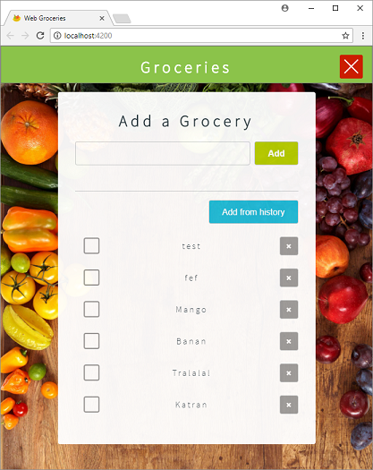

# NGXP Groceries App
Groceries application for Web and Mobile (Android, iOS) with single code base buit with Angular and Nativescript. 

Groceries is a NativeScript and Angular built iOS, Android and Web app for managing grocery lists.

The app comes from the idea to merge the official Nativescript tutorial application [sample-Groceries](https://github.com/NativeScript/sample-Groceries) with the awesome [NGXP](https://ngxp.io/) concept.

You can learn how to build the Nativescript version of this app from scratch using either Nativescript's [JavaScript getting started guide](http://docs.nativescript.org/tutorial/chapter-0), or Nativescript's [TypeScript and Angular getting started guide](http://docs.nativescript.org/angular/tutorial/ng-chapter-0).

If you want to create your own cross-platform app similar to this, check this starter: [nativescript-angular-web-starter](https://github.com/shripalsoni04/nativescript-angular-web-starter).

## Previews and Screenshots




## Prerequisites
1. Globally installed Nativecript  - `npm install -g nativescript`
2. Globally installed Angular CLI - `npm install -g angular-cli`
3. Mac OS to build iOS app.

## Installation
1. `git clone https://github.com/Monogramm/ngxp-groceries-app.git`
2. `cd ngxp-groceries-app`
3. `npm run ngxp-install`

## Run Web application
`npm start` - This will start the application at http://localhost:4200. 

## Run iOS Application
- First start the simulator or connect the iOS device.
- Execute `npm run start.ios` 
- **Note** - If you are using XCode8 then you need to set the DEVELPMENT_TEAM. There are two ways to set it.
  1. Using XCode
      - After executing `npm run start.ios` command, open project wordspace file nativescript/platforms/ios/nativescript.xcworkspace in XCode
      - Click on nativescript project in XCode and set Team from General Tab.
      - The issue with thie approach is, you need to set it everytime you remove and add the iOS platform.
  2. From build.xconfig (preferable)
      - Open nativescript/app/App_Resources/iOS/build.xconfig file.
      - Uncomment `DEVELOPMENT_TEAM = YOUR_TEAM_ID;` line, and enter your team id.

## Run Android Application
- First start the emulator or connect the iOS device.
- Execute `npm run start.android`

## Commands
You can execute any valid command of angular-cli from `web/` folder and any valid command of nativescript-cli from `nativescript/` folder.
For convenince below are the commands which you can execute from root directory.

### Common
| Command                | Description                                                                                                                          |
|------------------------|--------------------------------------------------------------------------------------------------------------------------------------|
| npm run ngxp-install   | Installs dependencies of web and nativescript applications. Creates symlink of x-shared folder in both web and nativescript project. |

### Web Application
| Command                | Description                                                                                   |
|------------------------|-----------------------------------------------------------------------------------------------|
| npm start              | Starts web application at http://localhost:4200                                               |
| npm run start.prod     | Starts web application in production mode. Runs uglification and minification.                |
| npm run start.aot      | Performs AOT for web application templates and starts web application.                        |
| npm run start.aot.prod | Performs AOT, minification, uglification and starts web application.                          |
| npm run build          | Builds the web application and copy the built project in web/dist folder.                     |
| npm run build.prod     | Builds the web application in production mode and copy the built project in web/dist folder.  |
| npm run build.aot      | Performs AOT, build the project and then copy the built project in web/dist folder.           |
| npm run build.aot.prod | Performs AOT, prepares production build and then copy the built project in web/dist folder.   |
| npm test               | Runs web application and x-shared unit test cases. It will not generate code coverage report. |
| npm run test-cc        | Runs web application and x-shared unit test cases and generates code coverage report.         |

### Nativescript Application
| Command                  | Description                                                                       |
|--------------------------|-----------------------------------------------------------------------------------|
| npm run start.ios        | Runs application on iOS emulator/device                                           |
| npm run start.android    | Runs application on Android emulator/device                                       |
| npm run clean.ios        | Cleans application on iOS emulator/device                                         |
| npm run clean.android    | Cleans application on Android emulator/device                                     |
| npm run restart.ios      | Cleans and restarts application on iOS emulator/device                            |
| npm run restart.android  | Cleans and restarts application on Android emulator/device                        |
| npm run test.ios         | Runs tests on iOS emulator/device. It will not generate code coverage report.     |
| npm run test.android     | Runs tests on Android emulator/device. It will not generate code coverage report. |

## Known Issues and Solution
1. Angular dependencies at two levels for AOT support
  - Currently we have added angular dependencies in root level package.json and web/package.json. Because, AOT does not work properly when we use path mapping and this issue is reported and can be traked at https://github.com/angular/angular-cli/issues/1732 and PR:https://github.com/angular/angular-cli/pull/2470. Once this issue is resolved we can add path mapping as shown below and remove the angular dependencies from web/package.json, so in case of any version update we just need to change the version at root directory level.

    **web/src/tsconfig.json**
    ```
    "paths": {
        "@angular/*": ["../../node_modules/@angular/*"]
      }
    ```
